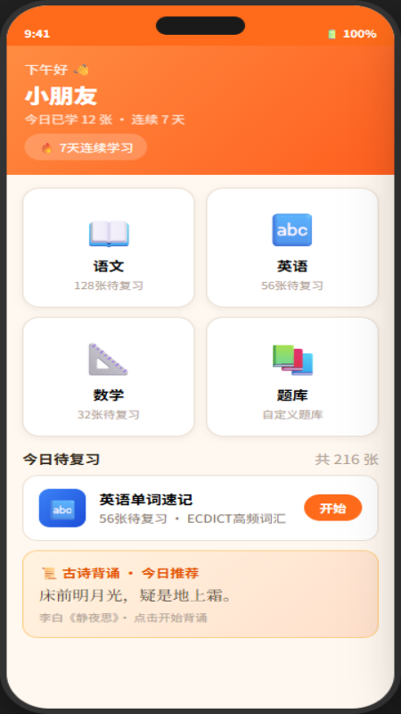
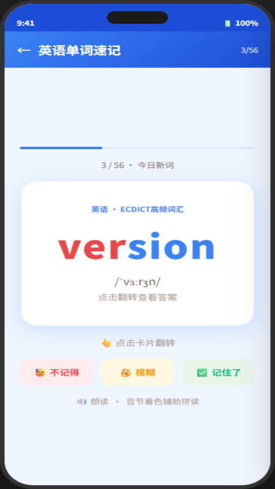
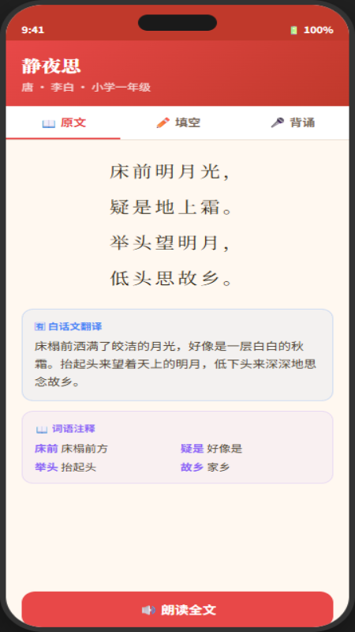

# 🧠 小记忆

> 专为中小学生设计的学习记忆辅助应用，支持语文、英语、数学全科目智能复习。

[](https://github.com/liangzihua/kids-memory)
[](https://github.com/liangzihua/kids-memory)
[](LICENSE)

---

## 📱 应用截图

| 主界面 | 英语闪卡 | 古诗背诵 |
|--------|----------|----------|
|  |  |  |

---

## ✨ 核心功能

### 📖 语文
- **古诗文背诵**：小学33首 + 唐宋66首，含白话文翻译、逐字注释、创作背景
- **生字词学习**：偏旁部首、笔画、拼音、例句
- **成语词典**：3000条常用成语

### 🔤 英语
- **单词速记**：音节着色辅助拼读，SM-2 间隔复习算法
- **短文背诵**：100篇（小学40篇 + 初中60篇），含中文译文和关键词
- **口语训练**：情景对话、跟读纠音
- **音标课程**：44个 IPA 音素完整讲解
- **语法要点**：中小学核心语法归纳

### 📐 数学
- **公式速记**：中小学数学公式大全
- **闪卡练习**：定义、定理、公式问答

### 🔍 其他功能
- **全局查询**：一键搜索所有题库内容
- **词库商店**：ECDICT 高频词、四六级、HSK、教育部常用字等11个词库
- **AI 智能生题**：支持 DeepSeek / 通义千问 / 豆包 / OpenAI
- **图片 OCR**：拍照或上传图片自动解析题目
- **语音功能**：TTS 朗读、STT 语音识别、跟读评分
- **多人档案**：支持家庭多个孩子独立学习档案

---

## 🚀 快速开始

### 方式一：本地运行（推荐）

```bash
# 克隆仓库
git clone https://github.com/liangzihua/kids-memory.git
cd kids-memory

# 安装依赖
npm install

# 启动本地服务器
node serve.js
```

浏览器打开 `http://localhost:3000`

**Windows 用户**：直接双击 `启动.bat`

> ⚠️ 不要直接双击 `index.html`，Chrome 在 `file://` 协议下无法加载本地数据文件

### 方式二：Android APK

从 [Releases](https://github.com/liangzihua/kids-memory/releases) 下载最新 APK 安装。

---

## 🛠️ 开发构建

### 环境要求
- Node.js 18+
- Python 3.x（用于数据处理脚本）
- Android SDK（构建 APK）

### 打包 JS

```bash
npx esbuild app/ui.js --bundle --outfile=bundle.js --format=iife --platform=browser --target=es2020
```

### 构建 Android APK

```bash
# 同步到 Android 工程
npx cap sync android

# 构建 Release APK（已配置签名）
cd android && ./gradlew assembleRelease

# APK 输出路径
# android/app/build/outputs/apk/release/app-release.apk
```

---

## 📂 项目结构

```
kids-memory/
├── app/                    # 核心 JS 模块
│   ├── ui.js               # 页面路由与交互逻辑
│   ├── core.js             # IndexedDB 数据层
│   ├── algorithm.js        # SM-2 间隔复习算法
│   ├── recitation.js       # 古诗文背诵模块
│   ├── passages.js         # 英语短文背诵模块
│   ├── english.js          # 英语学习中心
│   ├── speech.js           # 语音 TTS/STT
│   ├── pronunciation.js    # 发音评分
│   ├── ai.js               # AI 生题与 OCR
│   ├── parser.js           # 文件导入解析
│   └── vocab-store.js      # 词库商店
├── data/
│   └── builtin/            # 内置题库数据
│       ├── chinese/        # 语文（古诗、词语、成语）
│       ├── english/        # 英语（词汇、短文、语法）
│       └── math/           # 数学（公式、概念）
├── styles/
│   └── main.css            # 全局样式
├── android/                # Capacitor Android 工程
├── tools/                  # 数据处理脚本
├── store-assets/           # 应用市场上架素材
├── index.html              # 入口页面
├── bundle.js               # 打包后的 JS（esbuild 生成）
├── serve.js                # 本地开发服务器
├── sw.js                   # Service Worker
└── 启动.bat                # Windows 一键启动
```

---

## 📚 内置数据

| 类别 | 内容 | 数量 |
|------|------|------|
| 小学古诗 | 含翻译+注释 | 33 首 |
| 唐宋诗词 | 含翻译+注释 | 66 首 |
| 英语短文 | 小学+初中 | 100 篇 |
| 小学英语词汇 | PEP 教材 | 1600 词 |
| 初中英语词汇 | 新课标 | 1600 词 |
| 数学公式 | 小学+初中 | 200+ 条 |
| 成语词典 | 常用成语 | 3000 条 |
| 教育部常用字 | 3500字 + 2500字 | 6000 字 |

---

## 🔧 技术架构

- **前端**：纯 Vanilla JS + HTML5，无框架依赖
- **存储**：IndexedDB（本地存储，无服务器）
- **打包**：esbuild（单文件 bundle，支持 file:// 协议）
- **移动端**：Capacitor 6.x 封装为 Android APK
- **算法**：Leitner 盒子 + SM-2 间隔重复
- **语音**：Web Speech API（TTS + STT）
- **PWA**：Service Worker 离线支持

---

## 🔐 隐私说明

本应用**不收集任何个人信息**。所有学习数据仅存储在用户设备本地，不上传至任何服务器。

隐私政策：[https://liangzihua.github.io/kids-memory-privacy/](https://liangzihua.github.io/kids-memory-privacy/)

---

## 📋 待完善

- [ ] 初中文言文数据（桃花源记、岳阳楼记等）
- [ ] 唐宋诗词扩展至 150 首
- [ ] iOS 版本（需要 Mac + Xcode）
- [ ] 发布到更多国内应用市场（小米、OPPO、vivo）

---

## 📄 许可证

MIT License © 2025 liangzihua
